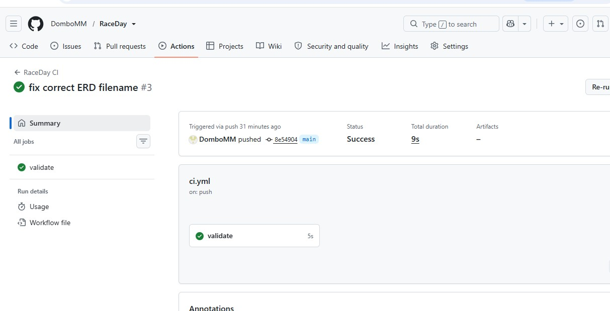

# RaceDay Event Management System

## Project Overview

RaceDay is an event management system designed for South African road-running, walking and cycling events. The system provides a structured way for organisers to manage events and for participants to enrol in events and view their results.

## Project Purpose

The purpose of RaceDay is to provide a centralised system for managing road events, participants, event categories, enrolments and race results.

## User Roles

### Organiser

Organisers can:
- Create and manage events.
- Specify the event type, date, location and distance.
- Manage event categories.
- Manage participant enrolments.
- Record race results.

### Participant

Participants can:
- View available events.
- Enrol in events.
- Select an event category.
- View their race results.

## Database

The RaceDay database is implemented using Microsoft SQL Server.

The database contains six main tables:

- Users
- EventTypes
- Events
- Categories
- Enrolments
- Results

The database script is available in the `docs` folder.

## Entity Relationship Diagram

The Entity Relationship Diagram (ERD) showing the database entities, primary keys, foreign keys and relationships is available in the `docs` folder.

## API Endpoint Plan

The RESTful API endpoint plan describes the planned API operations for the RaceDay system. It is available in the `docs` folder.

## Part 1 Documentation

The following Part 1 documents are available in the `docs` folder:

- `RaceDay_ERD.pdf`
- `RaceDay_API_Endpoint_Plan.pdf`
- `RaceDay_Database.sql`

## Technologies

- C#
- ASP.NET Core Web API
- Microsoft SQL Server
- Entity Framework Core
- GitHub
- GitHub Actions
- 
     ## CI/CD Status
   

     ## Tech Stack
   - Database: Microsoft SQL Server (SSMS)
   - Planning Tools: draw.io (ERD), Markdown (API documentation)
   - Version Control: Git & GitHub
   - CI/CD: GitHub Actions
